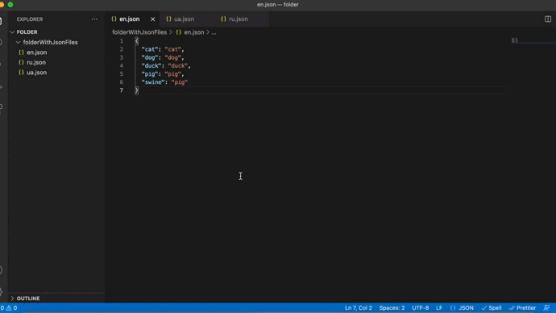
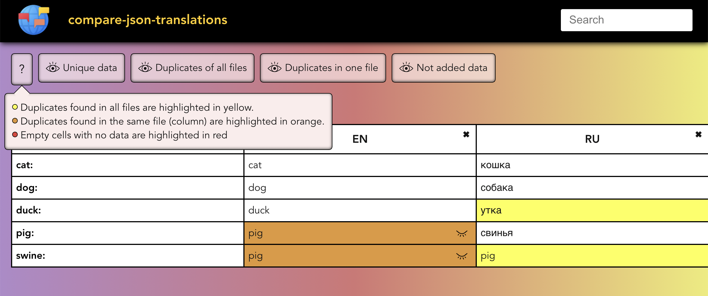

# :us: compare-json-translations

## Description
This npm compares all .json files and allows the user to quickly find missing or duplicate values ​​in those files.

## Usage
**1. First of all, you need to go to the directory where the .json files you want to check are located**  
**2. Then call the command:**  `npx compare-json-translations`  
**3. Wait a bit for data processing and table creation**

 

*localhost will automatically start in your browser*  

## Functional
  
* All .json files are output in a convenient tabular format.
* You can use the search by keys in the upper right corner.
* And also you can filter the table by the values ​​you are interested in  
(you can get information about filters by hovering your cursor over the icon with the "**?**" sign).
* If you want to delete one of the json files, just click the "✖" icon in the cell with the name of that file.

# :ru: compare-json-translations (Перевод)

## Описание
Этот npm сравнивает все файлы .json и позволяет пользователю быстро находить отсутствующие или повторяющиеся значения в этих файлах.

## Использование
**1. Прежде всего, вам нужно перейти в каталог, где находятся файлы .json, которые вы хотите проверить.**  
**2. Затем вызовите команду:**  `npx compare-json-translations`  
**3. Немного подождите пока обработаются данные и сгенерируется таблица**  

  

*localhost автоматически запустится в вашем браузере*

## Функционал
  
* Все файлы .json выводятся в удобном табличном формате.
* Вы можете воспользоваться поиском по ключам в правом верхнем углу.
* А также вы можете отфильтровать таблицу по интересующим вас значениям  
(вы cможете получить информацию о фильтрах, наведя курсор на иконку со знаком «**?**»).
* Если вы хотите удалить один из файлов json, просто щелкните значок «✖» в ячейке с именем этого файла.